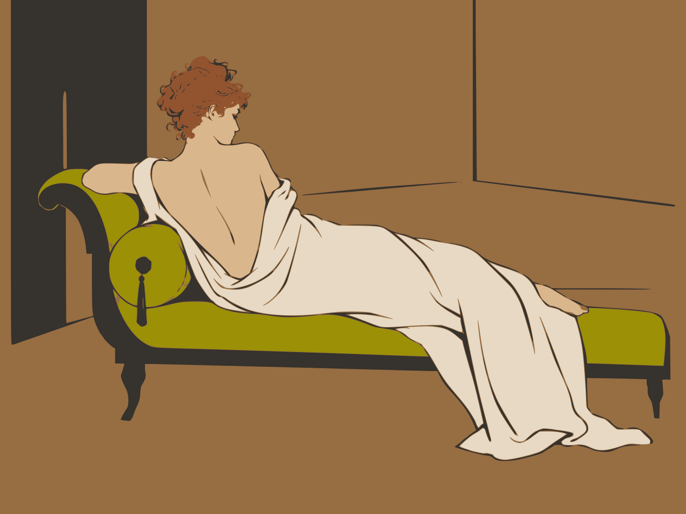

<strong>PROGRAMME</strong>

<h1 align="center">[TITRE DE LA PIÈCE]</h1>

<em>[forme de la pièce · nombre d’actes ou de tableaux]</em> [lieu · date · heure]

---

## Distribution

*Personnages* ........................................................ *Interprètes*

Madame Récamier ................................................. **[nom de l’interprète]**  
*([nom], doublure de Madame Récamier)*

Eugénie ................................................................ **[nom de l’interprète]**  
*([nom], doublure d’Eugénie)*

Augustin ............................................................... **[nom de l’interprète]**

## Équipe

Mise en scène ...................................................... **Justine & Juliette**  
Adaptation ............................................................ **[nom]**  
Régie ...................................................................... **[nom]**

---

## Argument

*[Argument à déterminer.]*

---

## Extrait

« Un jour, Sade mourra et, au ciel, ses personnages prendront vie et rejoueront leurs scènes ; il s’en réjouira, car tout y sera fidèle à ses desseins. »  

Un tintement.  

Deux jours : tiendra-t-elle jusque-là ? Sans dévier de l’orbite qu’elle trace déjà dans le boudoir, deux doigts d’Eugénie glisseront lentement sur le velours du canapé jusqu’à ce qu’un pli inattendu les arrête ; encore chargés de velours, ils s’élanceront aussitôt vers la peau de sa joue, tout près de ses lèvres déjà entrouvertes. « Avec tous vos miroirs, impossible d’échapper à ce bouton. » Les miroirs s’expliqueront plus tard.  

Alors, quand commence-t-on ? Eugénie sera déjà assise sur le canapé ; ses paumes inquiètes lisseront plusieurs fois la jupe impeccable de sa robe, leur courbe suivant l’étoffe le long des cuisses jusqu’à rencontrer, sous le tissu, ses genoux, bientôt contraints de s’écarter légèrement pour laisser Augustin se faire sa place à son tour.  

[…]  

« Mon Dieu, vous ne voulez tout de même pas dire que vous allez réellement… » Mais Dieu est une chimère. 
/ « Mon Dieu, vous ne voulez tout de même pas dire que vous allez réellement… Ah oui : Dieu n’est qu’une chimère. »  

[…]  

Un tintement.  

— Ce n’est pas pour vous. Restez assis. / (nous sonnerons dès qu’il faudra que tu reparaisses.)  

[…]  

L’étoffe froissée s’est coulée jusqu’au cœur du poing ; là, elle oppose aux doigts son indifférence.  

[…]  

— Tout va bien. Continuez.  

[…]  

Si vous ne vous dérobez pas, vous verrez une perle nacrée grossir lentement au coin de son œil ; autour d’elle, l’œil ouvert devient un mollusque charnu aux prises avec l’air. On a presque envie de l’aspirer.  
